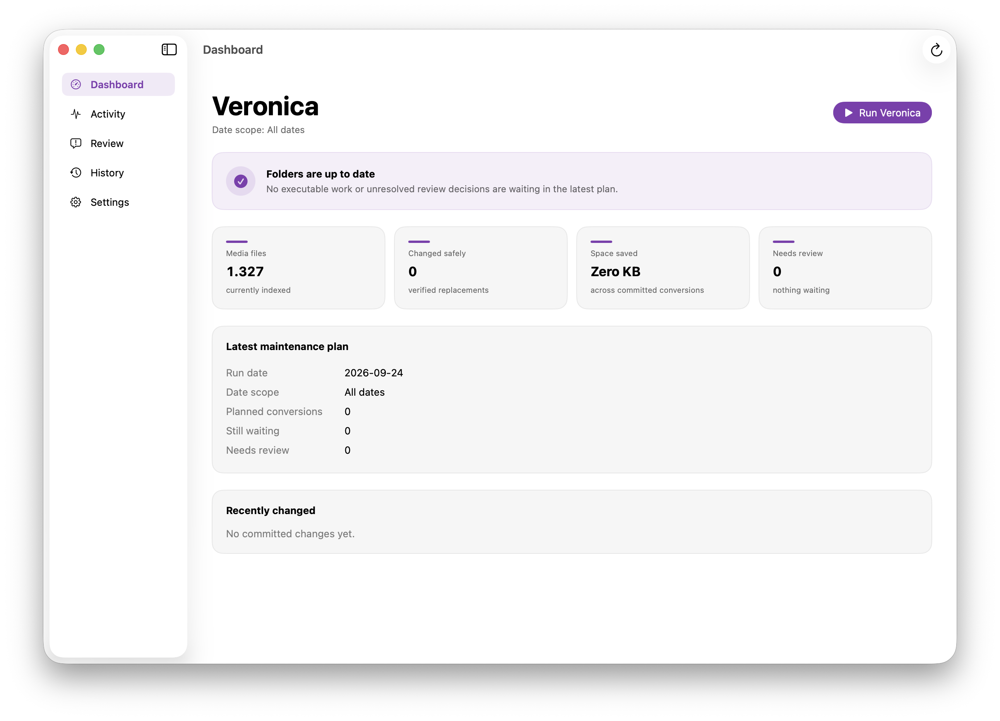

<div align="center">


# Veronica

### Take care of your media library.

A native macOS app for maintaining media libraries safely.

Veronica scans the folders you choose, plans maintenance before changing anything, verifies replacements before committing them, and stops for human review when it cannot make a safe decision automatically.

**Local-first · Native macOS · Safety-focused · Open source**

</div>

---

<p align="center">
  
</p>

## What is Veronica?

Veronica is a macOS utility for maintaining media libraries without blindly rewriting them.

You choose the folders Veronica is allowed to scan. It examines the media inside them, creates a maintenance plan, stages proposed replacements, verifies the results, and only then commits safe changes.

When Veronica cannot make a decision confidently, it stops and asks you instead.

## What Veronica does

- Scans one or more folders you choose
- Plans maintenance before changing files
- Verifies proposed replacements before committing them
- Stops instead of guessing when a file needs review
- Keeps a visible history of committed replacements
- Tracks space saved across completed work
- Supports configurable date scopes
- Can standardize media filenames
- Keeps diagnostics and maintenance data local to your Mac

## How it works

```text
Scan
  ↓
Plan
  ↓
Stage
  ↓
Verify
  ↓
Commit
```

If something needs human judgment:

```text
Scan → Plan → Review → Your decision
```

The guiding rule is simple:

> If Veronica cannot verify that an automatic change is safe, it does not silently commit it.

## Main sections

### Dashboard

The Dashboard shows the current state of your media library, including indexed media, committed replacements, space saved, items requiring review, and the latest maintenance plan.

### Activity

Activity shows live progress during a run and a record of what happened during the most recent run.

### Review

Review contains files that require a human decision. You can inspect the file and decide whether to preserve it or allow Veronica to process it using its normal policy.

### History

History is the audit trail of media replacements Veronica has actually committed.

### Settings

Settings controls scan folders, date scope, filename policy, Veronica data, runtime readiness, media tools, and diagnostics.

## Safety model

Veronica is designed around staged and verified maintenance rather than destructive bulk processing.

A normal replacement follows this general path:

1. Discover the source file.
2. Determine whether work is required.
3. Create a proposed output separately.
4. Verify the proposed output.
5. Commit the verified replacement.
6. Record the result in Veronica's history.

Files that cannot safely proceed through that process are preserved or sent for review.

## Requirements

Veronica is a native macOS application.

Its maintenance engine also checks for the runtime and media tools it needs. Their availability is shown under **Settings → Runtime & media tools**.

## Build from source

Clone the repository:

```bash
git clone https://github.com/tristanvangarsse/veronica-mac-app.git
cd veronica-mac-app
```

Open the Xcode project:

```bash
open macos/Veronica.xcodeproj
```

Or build from Terminal:

```bash
xcodebuild \
  -project macos/Veronica.xcodeproj \
  -scheme Veronica \
  -configuration Debug \
  build
```

## Contributing

Issues, bug reports, UI improvements, documentation fixes, and focused pull requests are welcome.

For visual changes, a before/after screenshot is helpful.

## License

See [LICENSE](LICENSE).
